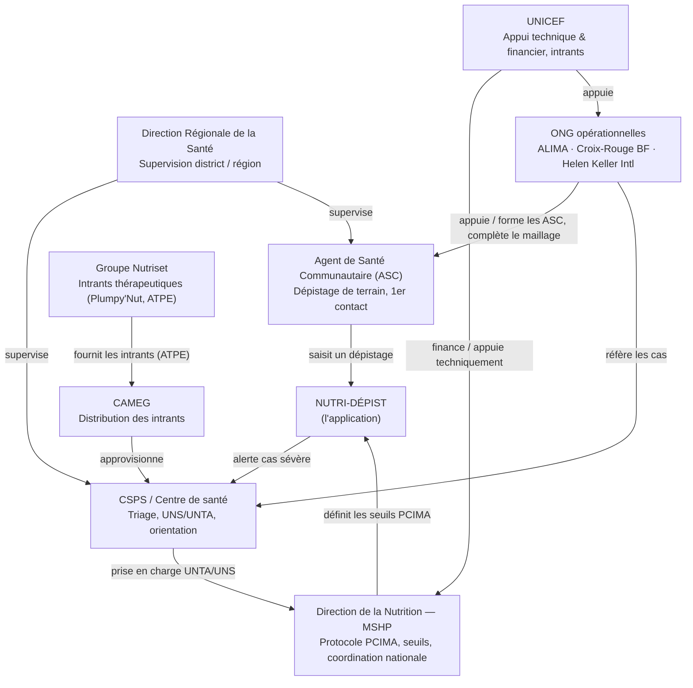

# Cartographie de l'écosystème — NUTRI-DÉPIST

*Rasmata, Volet 3 — brouillon de travail, à valider par l'équipe avant intégration au rapport.*

## Vue d'ensemble

## Les acteurs, rôle par rôle

### 1. Agent de Santé Communautaire (ASC)
Premier maillon : dépistage actif dans les villages/quartiers, mesure du périmètre
brachial (PB), repérage des œdèmes, orientation vers le CSPS. C'est l'utilisateur
principal visé par NUTRI-DÉPIST — d'où l'exigence de fonctionnement hors-ligne : une
grande partie du territoire couvert par les ASC n'a pas de couverture réseau fiable.
Le protocole PCIMA repose explicitement sur *"l'implication de la communauté dans la
sensibilisation, la prévention, le dépistage précoce, la référence et le suivi des cas
de malnutrition"* [Protocole National PCIMA, MSHP].

### 2. Centre de Santé et de Promotion Sociale (CSPS)
Échelon suivant : triage, dépistage passif, et deux unités de prise en charge — Unité
de Nutrition Supplémentaire (UNS, malnutrition aiguë modérée) et Unité de Nutrition
Thérapeutique Ambulatoire (UNTA, malnutrition aiguë sévère sans complication). C'est là
que les alertes déclenchées par NUTRI-DÉPIST (`orientation_declenchee = true`) doivent
arriver rapidement. Le `centre_id` de chaque agent correspond à ce niveau — d'où
l'exigence de sécurité : un CSPS ne doit voir que ses propres dépistages.

### 3. Direction de la Nutrition (DN) — Ministère de la Santé (MSHP)
Autorité nationale propriétaire du Protocole National PCIMA (2014, aligné OMS 2006) et
des seuils cliniques utilisés par le moteur de classification. C'est l'interlocuteur
institutionnel naturel pour :
- valider les seuils codés dans la table `Seuils` (jamais en dur, conformément au
  contrat d'interface) ;
- envisager un déploiement pilote à l'échelle d'un district sanitaire (voir BMC).

### 4. Direction Régionale de la Santé (DRS) / niveau district
Supervision intermédiaire entre les CSPS et le niveau national — pertinente pour le
modèle de licence "par district" du Business Model Canvas.

### 5. ONG opérationnelles (ALIMA, Croix-Rouge burkinabè, Helen Keller International…)
Complètent le maillage communautaire là où le système public est sous tension
(zones à forte insécurité, déplacés internes) : formation des ASC, dépistages de
masse, référencement. Partenaires potentiels pour un pilote terrain rapide, hors du
circuit d'approbation ministériel plus long.

### 6. UNICEF
Appui technique et financier historique du dispositif national de nutrition (enquêtes
SMART, accords de distribution d'intrants avec le MSHP et la CAMEG). Acteur clé pour
le financement d'un éventuel passage à l'échelle.

### 7. Groupe Nutriset
Fabricant des aliments thérapeutiques prêts à l'emploi (ATPE / Plumpy'Nut) utilisés en
UNTA — partenaire du hackathon. Intérêt direct : un dépistage plus précoce et plus
fiable améliore le ciblage de la distribution de ses produits et réduit les ruptures
inutiles.

### 8. CAMEG
Centrale d'achat qui distribue les intrants nutritionnels aux structures de santé —
acteur logistique, pas utilisateur direct de l'app, mais destinataire indirect des
données agrégées (`/stats`) pour la planification des stocks.

## Sources

- Ministère de la Santé du Burkina Faso, *Protocole National de Prise en Charge
  Intégrée de la Malnutrition Aiguë (PCIMA)*, 2014.
- Ministère de la Santé du Burkina Faso, *Plan Stratégique Multisectoriel de
  Nutrition 2020-2024*, juin 2020.
- Direction de la Nutrition / Ministère de la Santé, *Enquête nutritionnelle
  nationale SMART*, données 2012 et suivantes (financement UNICEF, PAM, PADS).
- UN Nutrition, *Burkina Faso Nutrition Capacity Assessment & Plan*, 2023.
- Sorgho B., *Valeur ajoutée du passage à l'échelle de la PCIMAS sur l'accessibilité
  et la qualité des services au Burkina Faso*, Mémoire Master, Université Senghor,
  2015.

*(Sources consultées le 26/09/2026 — à compléter avec des références plus récentes
si l'équipe en trouve pendant le hackathon, notamment le rapport 2020-2024 le plus
à jour de la Direction de la Nutrition.)*
